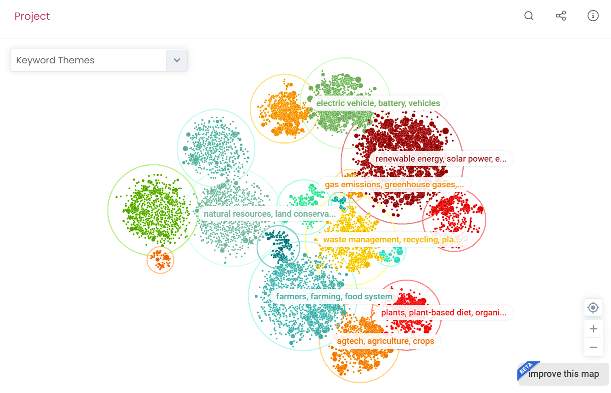
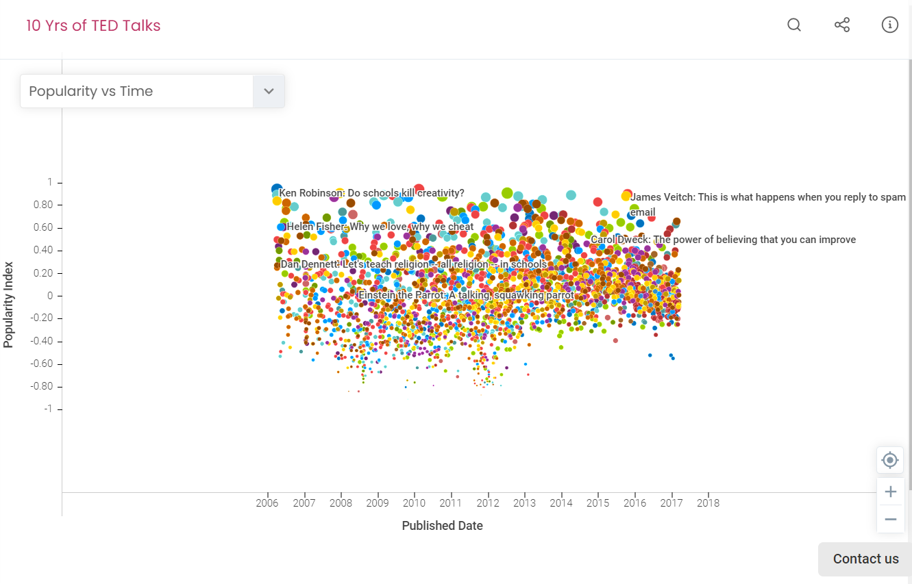
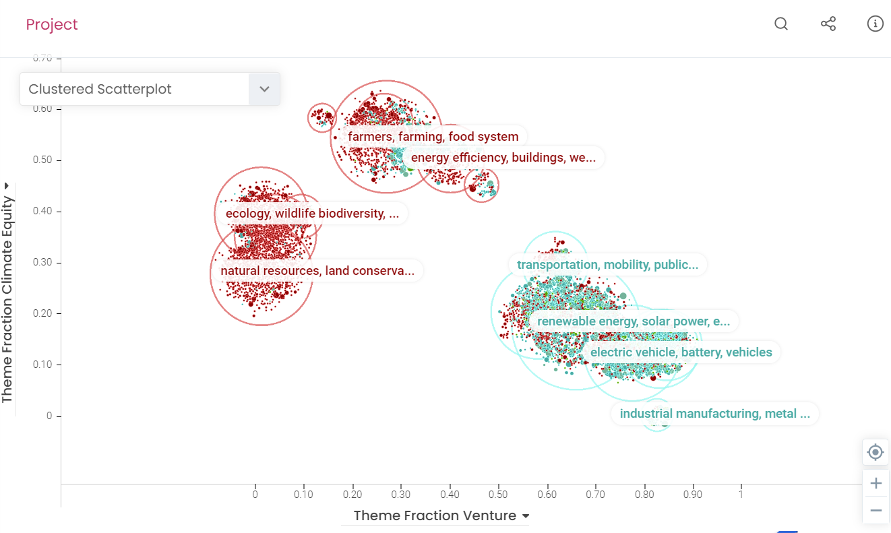
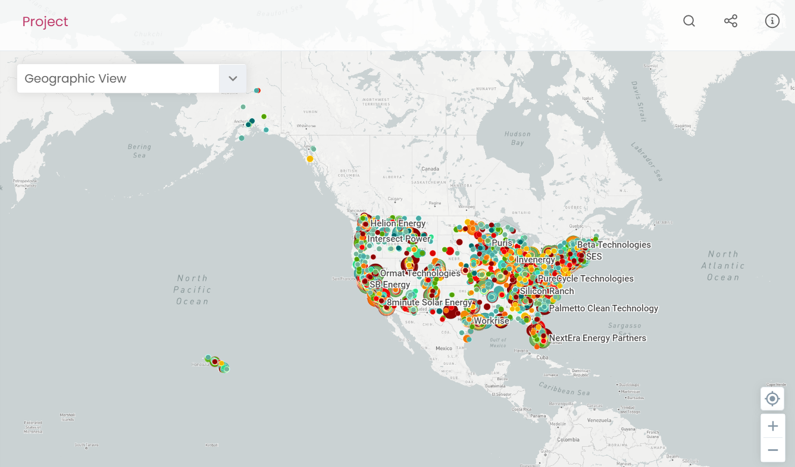

# Layouts Configuration

Layout object is one of the most important objects in the py2mappr project. It is used to define the layout of the map and the visualizations of the attributes. The layout object is created using the `create_layout(..)` method of the `mappr` module. 

Each project should contain at least one layout to be displayed. The layout object is attached to the project using the `create_layout(..)` method of the `mappr` module.

## Layout Types

### Clustered

The clustered layout is the default layout type. It is used to visualize the data points in the map. The data points are clustered based on the attributes.

### Scatterplot

The scatterplot layout used to place the data points in the map based on the values of the attributes.

### Clustered Scatterplot

This layout type allows to place clusters on the scatterplot.

### Geo

The geo layout is used to visualize the data points on the map based on the values of the attributes.

## Settings

All the layouts carry the same set of the settings. All the settings are stored in the `.settings` property of the layout object.

The layout settings could be updated by directly changing the `.settings` dictionary or by using utility methods, provided by `Layout` object:

        layout.settings.update({
            "drawEdges": False
        })

        # or

        layout.set_links()

Some settings are used to define the representation of the layout, e.g. name of it, and can be accessed directly:

        layout.name = "My Layout"
        layout.description = "My Layout Description"
        layout.x_axis = "My X Axis Attribute"

| Name | Data Type | Default Value | Description |
| ----------- | ----------- | ----------- | ----------- |
| drawNodes      | Boolean       | `True` | Whether to display nodes or not |
| borderRatio      | float       | `0.15` | Defines the ratio of border in the node |
| bigOnTop      | Boolean       | `False` | Whether the nodes should be z-sorted in the descending order |
| nodeImageShow      | Boolean       | `False` | Defines whether the node should display its image on hover. Requires `nodeImageAttr` to be set |
| nodeImageAttr      | str       | - | Defines the attribute from the dataset to be used as an image. It tries to be calculated when layout is created on the following logic: The column name must contain on of the following words: "image", "picture", "photo", "img", "img_url", "imgurl" and has the least amount of non-empty values, e.g. if there is an `image` column in the dataset which is filled for 80% datapoints and there is `picture` column which is filled for 90% datapoints, the `picture` column will be treated as `nodeImageAttr` |
| nodeUnselectedOpacity      | float       | `0.25` | Defines the opacity of nodes when they are not in the hover/selected state |
| nodeHighlightRatio      | float       | `1.20` | Defines the scale of the node when it is hovered |
| nodeHighlightBorderOffset      | float       | `6` | Defines the offset of radius of the node border when it is hovered |
| nodeHighlightBorderWidth      | float       | `1` | Defines the width of the node border when it is hovered |
| nodeSelectionRatio      | float       | `1.20` | Defines the scale of the node border when it is selected |
| nodeSelectionBorderOffset      | float       | `0` | Defines the offset of radius of the node border when it is selected |
| nodeSelectionBorderWidth      | float       | `3` | Defines the width of the node border when it is selected |
| nodeSelectionDegree      | int (min: 0, max: 3)       | `1` | Defines the degree of neighbors to be displayed when node is selected.  |
| isShowSelectedNodeTab      | Boolean       | `True` | Whether the info panel should be opened when node is selected |
| selectedNodeCommonTitle      | str       | `Neighbors` | Defines the title of the neighbors panel, when `edgeDirectional` is enabled and `neighbourListHoverDegree` is more than `0` |
| selectedNodeIncomingTitle      | str       | `Incoming` | Defines the title of the neighbors panel, when `edgeDirectionalRender == "all"` and `neighbourListHoverDegree` is more than `0` |
| selectedNodeOutgoingTitle      | str       | `Outgoing` | Defines the title of the neighbors panel, when `edgeDirectionalRender == "all"` and `neighbourListHoverDegree` is more than `0` |
| neighbourListHoverDegree      | int (min: 0, max: 3)       | `1` | Defines the degree of neighbor nodes to be checked, when any node in the neighbors list is hovered |
| nodePopShow      | Boolean       | `False` | Whether to scale up the node after some delay, defined by `nodePopDelay`, when it is hovered.  |
| nodePopSize      | int       | `10` | Scale multiplier for the node, when it is in 'popped' state. Requires `nodePopShow` to be enabled |
| nodePopImageShow      | Boolean       | `True` | Whether to show the image when the node is in 'popped' state. Requires `nodePopImageAttr` to be set. |
| nodePopImageAttr      | str       | - | Defines the attribute from the dataset to be used as an image, when the node is in 'popped' state. Follows the same calculation logic, as `nodeImageAttr`. Requires `nodePopShow` to be enabled |
| nodePopDelay      | int       | `1500` | Amount of time in milliseconds to transition node into the 'popped' state. Requires `nodePopImageAttr` to be set. |
| drawEdges      | Boolean       | `False` | Whether to draw links between nodes. Links are taken from the 'network' DataFrame in the project |
| edgeDirectional      | Boolean       | `True` | Whether to treat links as directional. |
| edgeTaper      | Boolean       | `False` | Whether to have different edge width near the 'source' and 'target' nodes |
| edgeTaperScale      | float       | `0.5` | Defines the scale of the edge near the 'target' node |
| edgeSaturation      | float (min: 0, max: 1)       | `1` | Defines the color saturation of the node |
| edgeUnselectedOpacity      | float (min: 0, max: 1)       | `0.2` | Defines the opacity of the edge if it does not belong to the selected node |
| edgeDirectionalRender      | str `all / none / outgoing / incoming`     | `outgoing` | Defines what edges should be displayed |
| drawLabels      | Boolean     | `True` | Whether to draw node labels, displays the attributes defined in the `labelAttr` and `labelHoverAttr` |
| drawGroupLabels      | Boolean     | `True` | Whether to draw group labels |
| labelColor      | str (hex color)     | `#000000` | Defines the color of the node labels |
| labelOutlineColor      | str (hex color)     | `#ffffff` | Defines the color of the node label outline |
| labelSize      | str `fixed / proportional`    | `proportional` | Defines the strategy used to render the node labels. `fixed` - labels will be rescaled according to the `minLabelSize` and `defaultLabelSize` when node is in hovered state. `proportional` - all node sizes will be interpolated between `minLabelSize` and `maxLabelSize` and the relevant value will be calculated based on `labelSizeRatio`. |
| labelScale      | float (min: 0, max: 1)     | `1` | Defines the scale of the label comparing to the node when in 'popped' state |
| labelSizeRatio      | float     | `0.5` | For `proportional` strategy only, calculates the label size on the sizes interpolation range |
| defaultLabelSize      | int, px     | `12` | For `fixed` strategy only, defines the label size in pixels |
| minLabelSize      | int, px     | `12` | Defines the minimum possible label size |
| maxLabelSize      | int, px     | `16` | Defines the maximum possible label size |
| labelThreshold      | int     | `1` | Calculates the amount of labels to be displayed in any point of screen at any time |
| labelMaxCount      | int     | `300` | Defines the amount of labels which can be simultaneously displayed on the screen |
| labelDefaultShow      | Boolean     | `True` | Whether to show labels |
| labelAttr      | str     | - | What attribute from the nodes DataFrame should be used to render the label. It tries to be predicted when the layout is created on the following logic: the column name must contain (case insensitive) of the following words: 'originallabel', 'name', 'title', 'label'. The column with less empty values will be taken as a label attribute.  |
| labelHoverAttr      | str     | - | Defines what node attribute should be rendered when node in hover state. Follows the same calculation logic, as `labelAttr`  |
| labelOpacity      | float (min: 0, max: 1)     | `1` | Defines label opacity  |
| labelUnselectedOpacity      | float (min: 0, max: 1)     | `0` | Defines label opacity when the corresponding node is in the unselected state  |
| zoomLock      | Boolean     | `False` | Defines whether the zoom operation in the project must be disabled  |
| panLock      | Boolean     | `False` | Defines whether the pan operation in the project must be disabled  |
| maxZoomLevel      | int     | `10` | Defines the maximum zoom level  |
| minZoomLevel      | int     | `-10` | Defines the minimum zoom level  |
| savedZoomLevel      | int     | `-2` | Defines the initial zoom level  |
| zoomingRatio      | float     | `1.7` | Defines the scale when transitioning between zoom levels  |
| mouseZoomDuration      | int, ms     | `500` | Defines the amount of time for what the zoom must occur  |
| xAxShow      | Boolean     | `False` | Valid for scatterplot/clustered-scatterplot. Whether to display X axis  |
| yAxShow      | Boolean     | `False` | Valid for scatterplot/clustered-scatterplot. Whether to display Y axis  |
| xAxTickShow      | Boolean     | `False` | Valid for scatterplot/clustered-scatterplot. Whether to display ticks on X axis  |
| yAxTickShow      | Boolean     | `False` | Valid for scatterplot/clustered-scatterplot. Whether to display ticks on Y axis  |
| invertX      | Boolean     | `False` | Valid for scatterplot/clustered-scatterplot. Whether to invert values for X axis  |
| invertY      | Boolean     | `True` | Valid for scatterplot/clustered-scatterplot. Whether to invert values for Y axis  |
| scatterAspect      | float     | `0.5` | Valid for scatterplot/clustered-scatterplot. Calculates the range of the axes  |
| mapboxMapID      | str     | - | Valid for geo layout. Uses the specific mapbox map.  |
| nodeSizeStrat      | str `attr / fixed`     | `attr` | Defines a strategy for calculating the node size. In the case of `attr`, requires `nodeSizeAttr` to be set. In the case of `fixed`, takes the value from `nodeSizeDefaultValue` field  |
| nodeSizeAttr      | str | - | Defines the attribute to be used to calculate the size of the nodes. It tries to find the attribute when the layout is created on the following logic: tries to find a numeric column which has the least amount of empty values.  |
| nodeSizeScaleStrategy      | str `log / linear`     | `log` | Defines what scale should be applied while calculating the node size  |
| nodeSizeScaleInvert      | Boolean     | `False` | Whether to invert node size scale calculation  |
| nodeSizeDefaultValue      | int     | `10` | Defines default size when `nodeSizeStrat == "fixed"`  |
| nodeSizeMin      | int     | `2` | Defines minimum size when `nodeSizeStrat == "attr"`  |
| nodeSizeMax      | int     | `20` | Defines maximum size when `nodeSizeStrat == "attr"`  |
| nodeSizeMultiplier      | float     | `0.5` | Defines the step between node sizes when `nodeSizeStrat == "attr"`  |
| nodeColorStrat      | str `attr / fixed`     | `attr` | Defines the strategy to calculate node colors. In the case of `attr` requires `nodeColorAttr` to be set.  |
| nodeColorAttr      | str    | - | Defines the attribute to be used while calculating the node color. When layout is created, tries to detect the color attribute name from the DataFrame based on the following logic: column must have the least distinct values and the least empty values  |
| nodeColorScaleStrategy      | str `linear / log`    | `linear` | Defines a strategy to be used while calculating node colors  |
| nodeColorScaleInvert      | Boolean    | `False` | Whether to invert node color scale or not  |
| nodeColorDefaultValue      | str, hex color    | `rgb(200, 200, 200)` | Sets the color of the node if `nodeColorStrat == "fixed"`  |
| nodeColorPaletteNumeric      | array of dict `{ col: hex color str }`    | `[{ col: "#ee4444"}, { col: "#3399ff"}]` | Defines the color palette for the nodes, if the numeric attribute is selected in the `nodeColorAttr`. First value colors the nodes with minimum value, last value color the nodes with maximum value. All the nodes between will have interpolated color  |
| nodeColorPaletteOrdinal      | array of dict `{ col: hex color str }`    | (see [_settings.py](https://github.com/vibrant-data-labs/py2mappr/blob/master/py2mappr/_layout/_settings.py)) | Defines the color palette for the nodes, if non-numeric attribute is selected in the `nodeColorAttr`. |
| edgeSizeStrat      | str `fixed / attr`    | `fixed` | Defines a strategy to calculate the size of links. In the case of `fixed` takes the value from `edgeSizeDefaultValue`, in the case of `attr` calculates the size based on the attribute set in `edgeSizeAttr`  |
| edgeSizeAttr      | str    | - | Defines the attribute to be used in links size calculation, must be set if `edgeSizeStrat == "attr"`. When the layout is created, tries to find a value from network DataFrame, based on the same logic as `nodeSizeAttr`  |
| edgeSizeScaleStrategy      | str `linear / log`    | `linear` | Defines a scale to be used while calculating link sizes, if `edgeSizeStrat == "attr"`  |
| edgeSizeScaleInvert      | Boolean    | False | Whether to invert a scale for link sizes  |
| edgeSizeDefaultValue      | float    | `0.2` | Defines a default value for link size, if `edgeSizeStrat == 'fixed'`  |
| edgeSizeMin      | float    | `0.1` | Defines a minimum size of links, if `edgeSizeStrat == 'attr'`  |
| edgeSizeMax      | float    | `10` | Defines a maximum size of links, if `edgeSizeStrat == 'attr'`  |
| edgeSizeMultiplier      | float    | `0.1` | Defines a step between node values, if `edgeSizeStrat == 'attr'`  |
| edgeColorStrat      | str `fixed / gradient / attr`    | `gradient` | Defines a strategy for calculating the color of the links. In the case of `gradient` link takes colors from the source and target nodes, if `fixed`, then it takes the value from `edgeColorDefaultValue`, if `attr`, it takes the value from the scale, built using `edgeColorAttr`  |
| edgeColorScaleStrategy      | str `linear / log`    | `linear` | Defines a scale for calculating the color of the links, if `edgeColorStrat == "attr"` |
| edgeColorScaleInvert      | Boolean    | `False` | Whether to invert a color scale, if `edgeColorStrat == "attr"` |
| edgeColorDefaultValue      | str, hex color    | `rgb(200,200,200)` | Defines a default color for links, if `edgeColorStrat == "fixed"` |
| edgeColorPaletteNumeric      | array of dict `{ col: hex color str }`   | (see [_settings.py](https://github.com/vibrant-data-labs/py2mappr/blob/master/py2mappr/_layout/_settings.py)) | Defines a color palette for links, if numeric attribute is set in the `edgeColorAttr` and `edgeColorStrat == "fixed"` |
| edgeColorPaletteOrdinal      | array of dict `{ col: hex color str }`   | (see [_settings.py](https://github.com/vibrant-data-labs/py2mappr/blob/master/py2mappr/_layout/_settings.py)) | Defines a color palette for links, if non-numeric attribute is set in the `edgeColorAttr` and `edgeColorStrat == "fixed"` |
| edgeCurvature      | int   | `0` | Defines a level of curvature applied for the links |
| drawClustersCircle      | Boolean   | `False` | Whether circles around the clusters should be rendered |
| nodeClusterAttr      | str   | - | Defines an attribute for rendering clusters circles. When the layout gets created, it calculates it from the `DataFrame`, based on the same logic as for `nodeColorAttr` |

## Layout defaults overrides

Depending on the type of the layout, it overrides the default settings for it.

### Clustered

It does not have any additional settings.

### Scatterplot

| Setting | Default Value|
|---------|--------------|
| xAxShow | `True` |
| yAxShow | `True` |
| xAxTickShow | `True` |
| yAxTickShow | `True` |
| invertX | `False` |
| invertY | `True` |
| scatterAspect | `0.5` |
| drawGroupLabels | `False`  |

### Clustered Scatterplot

| Setting | Default Value|
|---------|--------------|
| xAxShow | `True` |
| yAxShow | `True` |
| xAxTickShow | `True` |
| yAxTickShow | `True` |
| invertX | `False` |
| invertY | `True` |
| scatterAspect | `0.5` |
| drawGroupLabels | `False`  |

### Geo

| Setting | Default Value|
|---------|--------------|
| mapboxMapID | `"mapbox/light-v10"` |
| drawGroupLabels | `False`  |

## Layout display settings

Layouts have a set of display settings, which are used to render the layout. They are stored as the direct fields of the layout object.

#### `name`

Name of the layout, used for rendering the layout in the UI.

        layout.name = "My layout"

#### `descr`

HTML or Markdown Description of the layout, used for rendering the layout in the UI.

        layout.descr = "
My layout description
"

#### `subtitle`

Subtitle of the layout, used for rendering the layout in the UI.

        layout.subtitle = "My layout subtitle"

#### `image`

Image of the layout, used for rendering the layout in the UI.

        layout.image = "https://myimage.com/image.png"

#### `x_axis`, `y_axis`

X and Y axis attributes for the layout, used for rendering the nodes in the UI.

        layout.x_axis = "X_attribute"
        layout.y_axis = "Y_attribute"

This fields are required for displaying nodes. They both are tried to be found in the `DataFrame` passed to the layout, based on the following logic:
1. If there is an attribute which name matches `X` case-insensitive, it checks whether `Y` is present in the `DataFrame` as well. If so, it uses `X` and `Y` as the axis attributes.
2. Otherwise it checks whether there is an attribute which name includes `x` case-insensitive, and if found, checks if the matching attribute for `y` is present in the `DataFrame`. If they both are present, it uses them as the axis attributes.
3. If none of the above is found, it requires the user to set the axis attributes manually.

E.g. if there is a `DataFrame` with the following attributes: `['name', 'x', 'y', 'x_attr', 'y_attr']`, it will take the `x` and `y` attributes.

if there is a `DataFrame` with the following attributes: `['name', 'x_attr', 'y_attr']`, it will find the `x_attr`, then replace `x` with `y` and check if `y_attr` is present in the `DataFrame`, so `x_attr` and `y_attr` will be used as the axis attributes.

#### Clustered Scatterplot - `clusterXAttr`, `clusterYAttr`

Clustered Scatterplot has two additional axis attributes, which are used for rendering the clusters in the UI.

        layout.clusteredXAttr = "X_attribute"
        layout.clusteredYAttr = "Y_attribute"

It is calculated based on the same logic as for `x_axis` and `y_axis`.

This layout requires all 4 axis fields to be set, since it takes `cluster*` fields to position the cluster, and then takes `x_axis` and `y_axis` to position the nodes inside the cluster.

#### Geo Layout - `x_axis`, `y_axis`

In the case of Geo Layout, these attributes are used to calculate the position of the nodes on the geo map.

        layout.x_axis = "Latitude"
        layout.y_axis = "Longitude"

It is calculated based on the same logic as for `x_axis` and `y_axis`, but checks the match for `lat` and `lon` strings case-insensitive.

## Shortcut methods

`Layout` object provides a set of methods to simplify the modification of the settings for the layout.

#### `set_display_data`

Sets the display data for the layout, which is used for rendering the layout in the UI.

It allows to set the following fields of the layout: `name`, `descr`, `subtitle`, `image`. 

        layout.set_display_data(
            name="My layout",
            description="
My layout description
", subtitle="My layout subtitle",
            image="https://myimage.com/image.png")

#### `set_clusters`

Enables the clusters for the specific layout. It allows to set `drawClusters` to True and defined `nodeClusterAttr`.

        layout.set_clusters()
        # or
        layout.set_clusters("Cluster Attribute")

#### `set_links`

Enables the links for the specific layout. It allows to modify the following attributes: `drawLinks`, `edgeCurvature`, `edgeDirectionalRender`, `edgeSizeDefaultValue`, `nodeSelectionDegree` and `edgeSizeMin`, `edgeSizeMax`, `edgeSizeMultiplier`.

        layout.set_links()
        # or
        layout.set_links(
            link_curve=0,
            link_weight=1,
            direction="outgoing",
            edge_size_scaling=(15, 5, 0.1)
        )

#### `set_nodes`

Nodes are enabled by default, this method allows to modify some specific properties related to the nodes. It allows to adjust the following attributes: `nodeColorAttr`, `nodeClusterAttr`, `nodeSizeAttr` and `nodeSizeMin`, `nodeSizeMax`, `nodedSizeMultiplier`.

        layout.set_nodes()
        # or
        layout.set_nodes(
            node_color="Color Attribute",
            node_size="Size Attribute",
            node_size_scaling=(15, 5, 0.1)
        )

#### `set_palette`

Allows to set `nodeColorPaletteOrdinal`, `nodeColorPaletteNumeric`, `edgeColorPaletteOrdinal` and `edgeColorPaletteNumeric` at the same time.

        layout.set_palette(ordinal_palette, numeric_palette)
